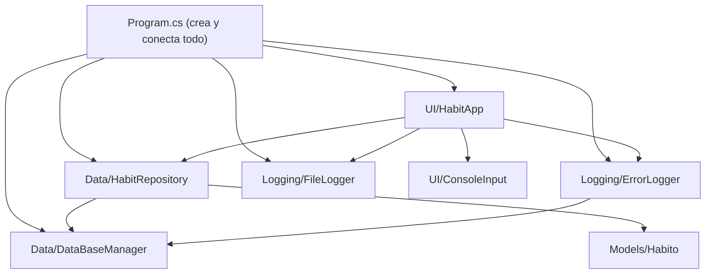
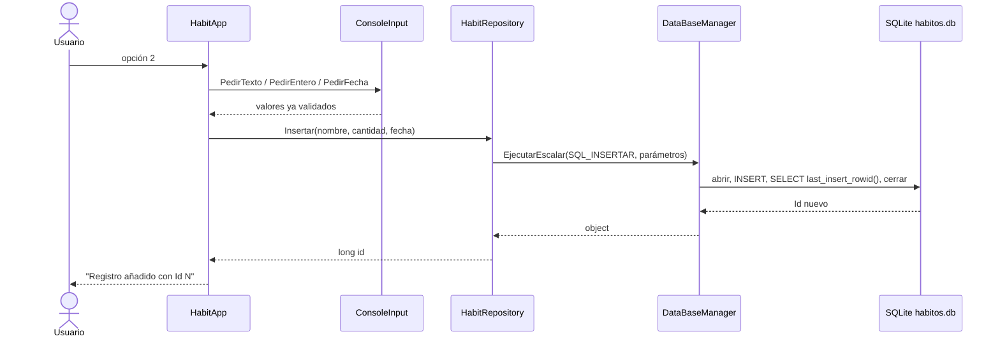

# HabitLogger — Registro de hábitos con C# y SQLite

Aplicación de consola que registra **ocurrencias de un hábito por cantidad y fecha** (por ejemplo, *8 vasos de agua el 01/10/2026*) y las guarda en una **base de datos SQLite real**.

Proyecto del **Caso Práctico 2** del módulo *Diseño de Interfaces*. Igual que el anterior, está pensado para añadirle una GUI en unidades posteriores.

Este README continúa los apuntes de **MathGame** (Caso Práctico 1). **Lo que ya está explicado allí no se repite**: cuando hace falta, se remite con la notación «→ *MathGame §6.11*». Aquí se explica solo lo **nuevo**: bases de datos, ADO.NET, `using`/`IDisposable`, *records*, delegados y genéricos, fechas, ficheros, estrategia de errores y los principios DRY y KISS.

---

## 1. Qué hace el programa y cómo cumple el enunciado

- Menú con cuatro acciones: **ver**, **añadir**, **actualizar** y **eliminar** registros.
- Cada registro tiene: hábito (texto), **cantidad** (entero positivo) y **fecha**.
- El hábito se mide **solo por cantidad**, nunca por tiempo (vasos de agua, flexiones, páginas leídas… no «horas de sueño»).
- Al escribir una fecha se puede teclear **`hoy`** (o `h`) para usar la fecha actual.
- Al arrancar crea la base de datos y las tablas si no existen.
- Todo error se gestiona: la aplicación **no se cierra** por un fallo.

| Requisito del enunciado | Dónde se cumple |
|---|---|
| Registrar ocurrencias de un hábito por cantidad | Tabla `Habitos` (`Cantidad INTEGER CHECK > 0`) |
| El usuario introduce la fecha | `ConsoleInput.PedirFecha` |
| Datos en una base de datos real | `DataBaseManager` + `HabitRepository` (SQLite) |
| Crear la BD SQLite si no existe | `SqliteOpenMode.ReadWriteCreate` en `DataBaseManager` |
| Crear la tabla del hábito al iniciar | `HabitRepository.CrearTabla()` desde `Program.cs` |
| Insertar, eliminar, actualizar y ver | `HabitApp` (opciones 1–4) → métodos del repositorio |
| Gestionar todos los errores | §6.10: validación + captura central + captura de último recurso |
| Principio DRY | §7 |
| Consejo: aplicar KISS | §7 |
| Consejo: comando para «hoy» | `ParseFecha` acepta `hoy` / `h` |
| Consejo: validar fechas, opciones y texto en vez de número | `ConsoleInput` (§6.7) |
| **Extra 1:** clase que guarda errores en una tabla | `ErrorLogger` → tabla `Errores` |
| **Extra 2:** log diario en `/logs`, un fichero por día | `FileLogger` → `logs/dd_MM_yyyy.log` |
| Código en un repositorio Git | Este repositorio |

---

## 2. Cómo ejecutarlo

**Requisitos:** SDK de **.NET 10** (el mismo `TargetFramework` que el ejemplo del profesor). La primera vez, `dotnet` descarga solo el paquete NuGet `Microsoft.Data.Sqlite` (§6.2); hace falta conexión a internet en ese momento.

```bash
cd HabitLogger        # carpeta que contiene HabitLogger.csproj
dotnet run
```

En Visual Studio: abrir `HabitLogger.sln` y `Ctrl+F5`. Los comandos `build` y `clean` son los de MathGame (→ *MathGame §2*).

**Dónde se crean los ficheros:** junto al ejecutable, es decir, en `HabitLogger/bin/Debug/net10.0/`:

```text
bin/Debug/net10.0/
├── habitos.db          ← base de datos SQLite
└── logs/
    └── 08_10_2026.log  ← un fichero por día de uso
```

Como están dentro de `bin/`, el `.gitignore` los excluye y **no se suben a Git**.

**Cómo mirar la base de datos por dentro:** con [DB Browser for SQLite](https://sqlitebrowser.org/) o la extensión *SQLite Viewer* de VS Code. Consultas útiles:

```sql
SELECT * FROM Habitos ORDER BY Fecha DESC;
SELECT * FROM Errores ORDER BY Id DESC;                       -- errores registrados
SELECT Nombre, SUM(Cantidad) AS Total FROM Habitos GROUP BY Nombre;   -- total por hábito
```

---

## 3. Ejemplo de ejecución

Sesión real. Se ve cómo se rechaza una opción inexistente (`7`), un texto donde va un número (`ocho`), una fecha imposible (`32/13/2026`) y una fecha futura (`31/12/2099`). Después se actualiza un registro pulsando Enter para conservar valores, y se elimina con confirmación.

```text
=== HABIT LOGGER - REGISTRO DE HÁBITOS ===
1. Ver hábitos registrados
2. Añadir registro
3. Actualizar registro
4. Eliminar registro
0. Salir
Opción: abc
Introduce un número entero entre 0 y 4.
Opción: 7
Introduce un número entero entre 0 y 4.
Opción: 2
Hábito (ej. Vasos de agua): Vasos de agua
Cantidad: ocho
Introduce un número entero entre 1 y 1000000.
Cantidad: 8
Fecha (dd/mm/aaaa o 'hoy'): 32/13/2026
Fecha no válida. Usa el formato dd/mm/aaaa (que no sea futura) o escribe 'hoy'.
Fecha (dd/mm/aaaa o 'hoy'): hoy
Registro añadido con Id 1.

(... se añade un segundo registro, "Flexiones", con la fecha 01/10/2026 ...)

Opción: 3

Id    Hábito         Cantidad  Fecha
1     Vasos de agua  8         08/10/2026
2     Flexiones      30        01/10/2026
Id del registro a actualizar: 2
(Pulsa Enter para mantener el valor actual)
Hábito [Flexiones]: 
Cantidad [30]: 35
Fecha [01/10/2026]: 
Registro actualizado.

(... el menú se repite y se elige la opción 4 ...)

Id del registro a eliminar: 2
¿Eliminar [2] Flexiones x35 el 01/10/2026? (s/n): x
Responde 's' o 'n'.
¿Eliminar [2] Flexiones x35 el 01/10/2026? (s/n): s
Registro eliminado.
```

**El fichero de log de esa sesión** (`logs/08_10_2026.log`):

```text
[07:48:09] Aplicación iniciada
[07:48:10] INSERTAR: [1] Vasos de agua x8 el 08/10/2026
[07:48:10] INSERTAR: [2] Flexiones x30 el 01/10/2026
[07:48:10] VER: listado de hábitos
[07:48:11] ACTUALIZAR: [2] Flexiones x30 el 01/10/2026  ->  [2] Flexiones x35 el 01/10/2026
[07:48:11] ELIMINAR: [2] Flexiones x35 el 01/10/2026
[07:48:11] VER: listado de hábitos
[07:48:11] Aplicación cerrada
```

---

## 4. Estructura del proyecto

```text
HabitLogger/                       ← raíz del repositorio
├── HabitLogger.sln
├── README.md
├── .gitignore
└── HabitLogger/                   ← proyecto
    ├── HabitLogger.csproj
    ├── Program.cs                 ← punto de entrada y raíz de composición
    ├── Models/
    │   └── Habito.cs              ← el dato: Id, Nombre, Cantidad, Fecha
    ├── Data/
    │   ├── DataBaseManager.cs     ← acceso GENÉRICO a SQLite (el del profesor)
    │   └── HabitRepository.cs     ← TODO el SQL de la tabla Habitos
    ├── Logging/
    │   ├── ErrorLogger.cs         ← EXTRA 1: errores → tabla Errores
    │   └── FileLogger.cs          ← EXTRA 2: operaciones → logs/dd_MM_yyyy.log
    └── UI/
        ├── ConsoleInput.cs        ← lectura validada del teclado
        └── HabitApp.cs            ← menú, acciones y captura central de errores
```

Las carpetas siguen la idea de **capas** que ya se vio en MathGame (`Modelos`/`Servicios`/`Interfaz`), ahora con una capa nueva de **datos**. Cada carpeta tiene su propio namespace (`HabitLogger.Data`, `HabitLogger.UI`…).



**Regla de dependencias:** las flechas van de la interfaz hacia los datos, nunca al revés. `HabitRepository` no sabe que existe una consola; por eso, cuando llegue la GUI, se sustituye `UI/` y se reutiliza `Data/`, `Logging/` y `Models/` tal cual.

El recorrido completo de la acción **Añadir**:



---

## 5. Qué hay de nuevo respecto a MathGame

| Concepto nuevo | Dónde se explica |
|---|---|
| Base de datos relacional, SQL, tipos de SQLite | §6.1 |
| ADO.NET y el paquete NuGet `Microsoft.Data.Sqlite` | §6.2 |
| Consultas parametrizadas e inyección SQL | §6.3 |
| `IDisposable` y la instrucción `using` | §6.4 |
| Patrón Repositorio, `DataTable`, LINQ, `long` vs `int` | §6.5 |
| *Records* | §6.6 |
| Delegados, genéricos, lambdas y *closures* | §6.7 |
| `DateTime`, cultura y formatos de fecha | §6.8 |
| Ficheros, rutas y logs diarios | §6.9 |
| Estrategia de errores en capas; por qué aquí **sí** hay `catch (Exception)` | §6.10 |
| *Top-level statements* e `ImplicitUsings` | §6.11 |
| Otras novedades de sintaxis | §6.12 |
| DRY y KISS | §7 |

---

## 6. Apuntes

### 6.1 Bases de datos relacionales, SQL y SQLite

Hasta ahora los datos vivían en memoria y se perdían al cerrar. Una **base de datos** los guarda en disco. **SQLite** es una base de datos relacional que **no necesita servidor**: toda la base de datos es **un único fichero** (`habitos.db`) y el motor viaja dentro de la propia aplicación.

**CRUD ↔ SQL.** Las cuatro operaciones del enunciado se corresponden con cuatro sentencias:

| Operación | Sentencia | En el proyecto |
|---|---|---|
| **C**reate (insertar) | `INSERT INTO ... VALUES ...` | `HabitRepository.Insertar` |
| **R**ead (ver) | `SELECT ... FROM ...` | `Listar`, `ObtenerPorId` |
| **U**pdate (actualizar) | `UPDATE ... SET ... WHERE ...` | `Actualizar` |
| **D**elete (eliminar) | `DELETE FROM ... WHERE ...` | `Eliminar` |

> ⚠️ `UPDATE` y `DELETE` **sin `WHERE`** afectan a **todas** las filas de la tabla.

**La tabla, línea a línea:**

```sql
CREATE TABLE IF NOT EXISTS Habitos (
    Id       INTEGER PRIMARY KEY AUTOINCREMENT,
    Nombre   TEXT    NOT NULL,
    Cantidad INTEGER NOT NULL CHECK (Cantidad > 0),
    Fecha    TEXT    NOT NULL
);
```

| Parte | Significado |
|---|---|
| `IF NOT EXISTS` | Hace la sentencia **idempotente**: se puede ejecutar en cada arranque sin error. Es lo que permite «crear la tabla si no existe». |
| `PRIMARY KEY` | Identifica cada fila de forma única. |
| `AUTOINCREMENT` | El Id lo asigna la BD y **no reutiliza** Ids de filas borradas. |
| `NOT NULL` | La columna no admite valores vacíos (`NULL`). |
| `CHECK (Cantidad > 0)` | Restricción que la propia BD hace cumplir. Es la **última línea de defensa**: aunque un fallo del código dejara pasar un 0, la BD lo rechazaría. |

**Tipos en SQLite.** SQLite tiene **tipado dinámico**: solo hay cinco clases de almacenamiento (`NULL`, `INTEGER`, `REAL`, `TEXT`, `BLOB`) y una columna `INTEGER` **no impide estrictamente** guardar texto si este no se puede convertir. Por eso la validación en C# y el `CHECK` son importantes: no se puede confiar en que la BD rechace todo lo incorrecto.

**Las fechas no existen como tipo.** SQLite no tiene `DATE`. Se guardan como texto, número o fecha juliana. Aquí se elige **texto ISO 8601 (`yyyy-MM-dd`)** porque:

- **Ordena bien alfabéticamente** (`2026-09-30` < `2026-10-01`), así que `ORDER BY Fecha` funciona.
- Es legible al abrir la BD.
- Funciona con las funciones de fecha de SQLite (`date()`, `strftime()`).

En pantalla se muestra `dd/MM/yyyy`, que es lo habitual en España: **un formato para guardar y otro para mostrar** (→ §6.8).

### 6.2 ADO.NET y el paquete `Microsoft.Data.Sqlite`

**ADO.NET** es la parte de .NET para acceder a bases de datos. `Microsoft.Data.Sqlite` es el *proveedor* (driver) para SQLite. Equivalencias con JDBC, que es lo que se vio en Java:

| JDBC (Java) | ADO.NET (este proyecto) |
|---|---|
| URL `jdbc:sqlite:fichero.db` | Cadena de conexión `Data Source=fichero.db` |
| `Connection` | `SqliteConnection` |
| `PreparedStatement` con `?` | `SqliteCommand` con parámetros con nombre (`@nombre`) |
| `setString(1, valor)` | `Parameters.AddWithValue("@nombre", valor)` |
| `executeUpdate()` | `ExecuteNonQuery()` → nº de filas afectadas |
| `executeQuery()` → `ResultSet` | `ExecuteReader()` → lector; aquí se vuelca a un `DataTable` |
| Primera columna de la primera fila | `ExecuteScalar()` |
| `try-with-resources` | `using` (→ §6.4) |
| `SQLException` | `SqliteException` |

**Cadena de conexión.** `DataBaseManager` no la escribe a mano: usa `SqliteConnectionStringBuilder`, que evita errores de sintaxis. `SqliteOpenMode.ReadWriteCreate` significa «abrir para leer y escribir, **y crear el fichero si no existe**», que es lo que pide el enunciado.

**Los tres métodos según la forma del resultado:**

| Método de `DataBaseManager` | Se usa para | Devuelve |
|---|---|---|
| `EjecutarNonQuery` | `CREATE`, `INSERT`, `UPDATE`, `DELETE` | Nº de filas afectadas |
| `EjecutarEscalar` | Un único valor (p. ej. el Id recién creado) | `object?` |
| `EjecutarConsulta` | `SELECT` | `DataTable` |

**NuGet y `PackageReference`.** Las dependencias se declaran en el `.csproj` (como en `pom.xml`):

```xml
<PackageReference Include="Microsoft.Data.Sqlite" Version="10.0.11" />
```

Al compilar, `dotnet restore` (automático) descarga el paquete a una caché local (`~/.nuget/packages`). El paquete **incluye el motor nativo de SQLite**, así que no hay que instalar nada más.

**Pool de conexiones.** `DataBaseManager` abre y cierra la conexión **en cada operación**. Parece caro, pero `Microsoft.Data.Sqlite` mantiene un *pool* (conexiones reutilizables), por lo que `Close()` puede no cerrar realmente el fichero. Consecuencia práctica: mientras la aplicación corre, el `.db` puede seguir bloqueado y no te dejará borrarlo desde el explorador.

### 6.3 Consultas parametrizadas e inyección SQL

**Nunca se concatena texto del usuario dentro de una consulta.** Ejemplo del error:

```csharp
// ❌ MAL: el texto del usuario pasa a formar parte del SQL
string sql = "SELECT * FROM Habitos WHERE Nombre = '" + texto + "'";
```

Si el usuario escribe `x'; DROP TABLE Habitos; --`, el SQL resultante **borra la tabla**. Eso es una **inyección SQL**, una de las vulnerabilidades más graves y comunes.

```csharp
// ✅ BIEN: el SQL tiene huecos con nombre y los valores van aparte
const string SQL = "UPDATE Habitos SET Cantidad = @cantidad WHERE Id = @id;";
db.EjecutarNonQuery(SQL, new() { ["@cantidad"] = 35, ["@id"] = 2 });
```

Con parámetros, la BD recibe **la consulta y los datos por separado** y nunca interpreta los datos como SQL. Además, evita problemas de comillas (un hábito llamado `L'Hospitalet` no rompe nada) y de formato de números y fechas.

**`null` y `DBNull`.** En la BD «sin valor» es `NULL`, que en .NET se representa con `DBNull.Value`, no con `null`. `DataBaseManager` hace la conversión (`p.Value ?? DBNull.Value`) y, al leer, una columna vacía llega como `DBNull.Value`. En este proyecto ninguna columna admite `NULL`, pero la clase del profesor es genérica y lo contempla.

**`SELECT last_insert_rowid()`.** Tras un `INSERT`, esta función devuelve el Id que la BD acaba de asignar. Se ejecuta **en la misma sentencia** (`INSERT ...; SELECT last_insert_rowid();`) porque el valor es **propio de cada conexión**: como `DataBaseManager` cierra la conexión tras cada llamada, hacerlo en dos llamadas separadas no sería fiable.

### 6.4 `IDisposable` y la instrucción `using`

Algunos objetos guardan **recursos externos** que el recolector de basura no libera a tiempo: conexiones, ficheros, *sockets*. Esos tipos implementan `IDisposable`, cuyo método `Dispose()` libera el recurso **en el momento**. Es el equivalente a `AutoCloseable` en Java.

La palabra `using` significa **tres cosas distintas** en C#. Conviene no confundirlas:

| Uso | Ejemplo | Qué hace |
|---|---|---|
| Directiva | `using System.Data;` | Importa un namespace (→ *MathGame §6.2*) |
| Declaración | `using var db = new DataBaseManager(ruta);` | Llama a `Dispose()` **al salir del bloque** donde se declaró |
| Instrucción | `using (var x = ...) { ... }` | Llama a `Dispose()` al terminar las llaves |

La declaración con `using` equivale al `try-with-resources` de Java y el compilador la traduce a un `try/finally`.

**Dónde se aplica:**

- `Program.cs`: `using var db = ...` → la conexión se libera al terminar el bloque `try`.
- `DataBaseManager.Dispose()` cierra la conexión y la destruye. Incluye `GC.SuppressFinalize(this)`: avisa al recolector de que ya no hace falta el «finalizador» (la limpieza de emergencia), porque la limpieza ya se hizo a mano. Es el patrón estándar.
- Dentro de cada operación: `using var cmd = ...` y `using var reader = ...` liberan el comando y el lector.
- `finally { CerrarConexion(); }` garantiza que la conexión se cierra **aunque la consulta lance una excepción** (→ *MathGame §6.12* para `finally`).

**Detalle de `Program.cs`:** `fileLogger` se crea **antes** del `try`, no dentro. Así sigue existiendo cuando se ejecutan los `catch`, que lo necesitan para anotar el error. Una variable declarada dentro de un bloque `try` no existe en sus `catch`.

### 6.5 Patrón Repositorio, `DataTable` y LINQ

**Dos clases con responsabilidades distintas:**

| Clase | Conoce | No conoce |
|---|---|---|
| `DataBaseManager` | Cómo hablar con SQLite (abrir, ejecutar, cerrar) | Qué tablas hay ni qué significan |
| `HabitRepository` | El SQL de `Habitos` y cómo convertir filas en objetos | Cómo se abre una conexión; la consola |

Esto es el **patrón Repositorio**: una clase que **encapsula el acceso a los datos de una entidad** y expone métodos con objetos del dominio (`Insertar`, `Listar`…). El resto de la aplicación trabaja con `Habito` y **no ve ni una línea de SQL**. Si mañana cambia la base de datos o llega una GUI, solo se toca esta capa.

**De filas a objetos.** `EjecutarConsulta` devuelve un `DataTable`: una tabla **en memoria**, desconectada de la BD, formada por `DataRow` (filas) y columnas. El método `AHabito` hace el *mapeo* a mano:

```csharp
private static Habito AHabito(DataRow fila) => new(
    Convert.ToInt64(fila["Id"]),
    (string)fila["Nombre"],
    Convert.ToInt32(fila["Cantidad"]),
    DateTime.ParseExact((string)fila["Fecha"], FormatoBd, CultureInfo.InvariantCulture));
```

Herramientas como **Entity Framework Core** o **Dapper** hacen este trabajo automáticamente; aquí se hace a mano para ver cómo funciona.

**¿Por qué `Convert.ToInt32` y no `(int)`?** `fila["Cantidad"]` devuelve `object`. SQLite entrega **todos los enteros como `long`** (64 bits). Un *cast* directo `(int)objeto` es un **desempaquetado** (*unboxing*) y solo funciona si el tipo real es exactamente `int`: lanzaría `InvalidCastException`. `Convert.ToInt32` sí sabe convertir de `long` a `int`.

**LINQ.** En `Listar()`:

```csharp
_db.EjecutarConsulta(SQL_LISTAR).Rows.Cast<DataRow>().Select(AHabito).ToList();
```

- `Select(f)` aplica una función a cada elemento y devuelve los resultados (como `map` de los *streams* de Java).
- `ToList()` materializa el resultado en una `List<Habito>`.
- `Rows` es una colección **antigua, no genérica**, así que LINQ no puede usarla directamente: `Cast<DataRow>()` la convierte en una secuencia tipada.
- `Select(AHabito)` pasa un **grupo de métodos**: el nombre de un método sin paréntesis, usado como función (§6.7).

**Existencia de un registro.** `Actualizar` y `Eliminar` devuelven `bool` según las filas afectadas (`> 0`). Aunque la aplicación comprueba antes con `ObtenerPorId` que el Id existe, otro proceso podría borrarlo entre medias (un problema clásico llamado **TOCTOU**: *time of check, time of use*). Mirar el número de filas afectadas hace el código correcto en cualquier caso.

### 6.6 Records

```csharp
public record Habito(long Id, string Nombre, int Cantidad, DateTime Fecha);
```

Una sola línea crea una clase completa. El compilador genera por ti:

| Qué genera | Ventaja |
|---|---|
| Propiedades de **solo inicialización** (`init`) | El objeto es **inmutable** (→ *MathGame §6.4* para por qué importa) |
| Constructor con esos parámetros | `new Habito(1, "Agua", 8, hoy)` |
| **Igualdad por valor** | Dos `Habito` con los mismos datos son `==` (en una clase normal se compara la referencia) |
| `ToString()` legible | `Habito { Id = 1, Nombre = Agua, ... }` |
| Expresión `with` | Crea una copia cambiando solo algunos campos |

```csharp
Habito modificado = actual with { Cantidad = 12 };   // copia con otra cantidad
```

Un `record` es adecuado para **datos que viajan de un sitio a otro** (como una fila de BD) y no tienen comportamiento propio. Por eso `Habito` es un record y `HabitApp` es una clase.

### 6.7 Delegados, genéricos, lambdas y *closures*

Es la parte más avanzada del proyecto y está en `ConsoleInput`. El problema: hay que pedir **texto**, **enteros**, **fechas** y **sí/no**, y cada uno requiere el mismo bucle («pregunta → lee → ¿válido? → si no, avisa y repite»). Repetir ese bucle cuatro veces violaría DRY (§7).

**Solución: un método genérico que recibe la regla de validación como parámetro.**

```csharp
private delegate bool Parser<T>(string texto, out T valor);

private static T Pedir<T>(string mensaje, Parser<T> parser, string error, string? porDefecto)
{
    while (true)
    {
        Console.Write(mensaje);
        string texto = (Console.ReadLine() ?? throw new EndOfStreamException()).Trim();
        if (texto.Length == 0 && porDefecto != null) texto = porDefecto;

        if (parser(texto, out T valor)) return valor;
        Console.WriteLine(error);
    }
}
```

**Genéricos (`<T>`).** `T` es un tipo que se decide al llamar: `Pedir<int>` devuelve un `int`, `Pedir<DateTime>` un `DateTime`. Es el mismo concepto que los genéricos de Java (`List<T>`), pero en C# los tipos **se conservan en tiempo de ejecución** (en Java se «borran»).

**Delegados.** Un `delegate` define **«la forma de una función»**: aquí, «recibe un `string`, devuelve `bool` y rellena un `out T`». Una variable de ese tipo puede guardar cualquier método con esa forma, y se puede llamar como una función. Es lo más parecido a las interfaces funcionales de Java (`Function`, `Predicate`…).

C# trae delegados ya hechos: `Action` (sin parámetros ni resultado), `Func<...>` (con resultado) y `Predicate<T>`. Aquí se define uno propio porque **`Func` no admite parámetros `out`**.

**Tres formas de pasar una función:**

```csharp
// 1) Grupo de métodos: el nombre de un método existente, sin paréntesis
Pedir<string>(mensaje, ParseTexto, error, porDefecto);

// 2) Lambda: función anónima escrita en el sitio
Pedir<int>(mensaje,
    (string t, out int v) => int.TryParse(t, NumberStyles.Integer, CultureInfo.InvariantCulture, out v)
                             && v >= min && v <= max,
    error, porDefecto);

// 3) Método con nombre propio (ParseFecha, ParseSiNo): cuando la lógica es larga
```

En las lambdas con `out` hay que escribir los tipos de los parámetros. Con grupos de métodos se indica el tipo (`Pedir<string>`) explícitamente, porque el compilador no siempre puede deducirlo.

**Closures (clausuras).** La lambda de `PedirEntero` usa `min` y `max`, que **no son suyos**: son parámetros del método que la rodea. La lambda **captura** esas variables y las recuerda aunque `PedirEntero` ya haya terminado. Eso es lo que permite que un único `Pedir<int>` valga para «entre 0 y 4» y «entre 1 y 1.000.000». En Java una lambda solo puede capturar variables *efectivamente finales*; en C# puede capturar cualquier variable.

**El valor por defecto en la actualización.** Pulsar Enter conserva el valor actual. Se resuelve en `Pedir`: si la línea está vacía y hay `porDefecto`, **se sustituye por el texto del valor actual y pasa por el mismo parser**. No hay código especial para «mantener el valor» en cada tipo de dato.

**El menú como datos.** El menú es un diccionario de **tuplas** que asocia cada número con un texto y una acción:

```csharp
private readonly Dictionary<int, (string Texto, Action Accion)> _menu;

_menu = new()
{
    [1] = ("Ver hábitos registrados", VerHabitos),
    [2] = ("Añadir registro", Anadir),
    ...
};
```

- Una **tupla** `(string Texto, Action Accion)` agrupa varios valores sin crear una clase; los elementos tienen nombre.
- `["clave"] = valor` dentro de las llaves es un **inicializador de índice**.
- Se **deconstruye** al usarla: `var (texto, accion) = _menu[opcion];`.
- En el `foreach`, `var (numero, (texto, _))` deconstruye a la vez el par clave/valor y la tupla; `_` descarta lo que no se necesita.
- Para añadir una opción basta **una línea** nueva: el menú impreso, el rango válido (`_menu.Count`) y la ejecución se actualizan solos.

> Detalle honesto: un `Dictionary` no **garantiza** el orden de recorrido por contrato (en la práctica respeta el de inserción si no se borra nada). Si el orden fuera crítico, se usaría `SortedDictionary`.

### 6.8 Fechas y horas

**`DateTime` es un `struct`** (tipo valor), no una clase: se copia al asignarlo y nunca es `null`. Propiedades que se usan:

| | Qué devuelve |
|---|---|
| `DateTime.Today` | Hoy a las 00:00 (solo fecha) |
| `DateTime.Now` | Fecha y hora actuales |
| `.Date` | La misma fecha con la hora a 00:00 |

**¿Por qué `TryParseExact` y no `TryParse`?** `DateTime.TryParse("01/10/2026")` **depende de la cultura** del ordenador: en España es el 1 de octubre; en EE. UU., el 10 de enero. El mismo programa daría resultados distintos según dónde se ejecute. `TryParseExact` con una lista de formatos y `CultureInfo.InvariantCulture` da **siempre el mismo resultado**:

```csharp
private static readonly string[] FormatosFecha = { "d/M/yyyy", "d-M-yyyy", "yyyy-MM-dd" };

DateTime.TryParseExact(texto, FormatosFecha, CultureInfo.InvariantCulture,
                       DateTimeStyles.None, out valor)
```

Las `d` y `M` sueltas aceptan **uno o dos dígitos** (`1/10/2026` y `01/10/2026`). También rechaza fechas imposibles (`32/13/2026`, `31/02/2026`). La condición `valor.Date <= DateTime.Today` impide fechas futuras, porque un hábito registrado **ya ocurrió**.

**Especificadores de formato** (para `ToString("...")` y para `{valor:formato}` en cadenas interpoladas):

| Especificador | Significa | ⚠️ Cuidado |
|---|---|---|
| `yyyy` | Año con 4 dígitos | |
| `MM` | **M**es (01–12) | `mm` son los **minutos** |
| `dd` | Día del mes | |
| `HH` | Hora 00–23 | `hh` es de 1 a 12 (sin AM/PM) |
| `mm` | **m**inutos | `MM` es el mes |
| `ss` | Segundos | |

Un clásico: `"dd/mm/yyyy"` imprime los **minutos** en lugar del mes. Los caracteres que no son especificadores (como `_` en `dd_MM_yyyy`) se escriben tal cual.

### 6.9 Ficheros, rutas y logs diarios

```csharp
string carpetaBase = AppContext.BaseDirectory;
string rutaBd = Path.Combine(carpetaBase, "habitos.db");
```

- **`AppContext.BaseDirectory`** es la carpeta del ejecutable (`bin/Debug/net10.0/`). No es lo mismo que el *directorio de trabajo* actual (`Environment.CurrentDirectory`), que cambia según desde dónde se lance el programa. Usar el directorio del ejecutable da siempre el mismo sitio.
- **`Path.Combine`** une partes de una ruta con el separador correcto del sistema (`\` en Windows, `/` en macOS y Linux). Nunca se concatenan rutas con `+ "/" +`.

**`FileLogger`, paso a paso:**

```csharp
Directory.CreateDirectory(_carpeta);                           // 1) crea /logs si falta (si existe, no hace nada)
string fichero = Path.Combine(_carpeta, $"{ahora:dd_MM_yyyy}.log");   // 2) el nombre depende del día
File.AppendAllText(fichero, linea);                            // 3) añade al final; crea el fichero si no existe
```

Así se consigue «**un fichero por día**» sin código extra: al cambiar el día cambia el nombre y el primer `AppendAllText` crea el fichero nuevo. `Environment.NewLine` es el salto de línea propio del sistema operativo.

`File.AppendAllText` abre, escribe y cierra el fichero en cada llamada. Es simple y suficiente para una aplicación de consola; para registrar miles de líneas por segundo se mantendría un `StreamWriter` abierto.

### 6.10 Estrategia de gestión de errores

El enunciado exige que la aplicación **nunca colapse**. Para conseguirlo se combinan varias capas, de la más barata a la más drástica:

| Capa | Mecanismo | Ejemplo |
|---|---|---|
| 1. **Prevenir** | Validar antes de usar el dato | `ConsoleInput` repite la pregunta hasta que el dato es válido |
| 2. **Rechazar en la BD** | Restricciones SQL | `CHECK (Cantidad > 0)`, `NOT NULL` |
| 3. **Capturar por acción** | `try/catch` en `HabitApp.EjecutarProtegido` | Un fallo en «Añadir» no afecta al resto del menú |
| 4. **Último recurso** | `try/catch` en `Program.cs` | Fallo al abrir la BD, disco lleno… |
| 5. **Que registrar no falle** | `try/catch` dentro de cada logger | Si no se puede escribir el log, no se lanza otro error |

**Qué ocurre con cada fallo:**

| Fallo | Qué pasa |
|---|---|
| Letras en lugar de número, opción inexistente, fecha inválida o futura | `ConsoleInput` muestra el motivo y vuelve a preguntar |
| Id que no existe | Mensaje y vuelta al menú |
| Registro borrado mientras se editaba | `Actualizar`/`Eliminar` devuelven `false` → mensaje |
| `SqliteException` (BD bloqueada, tabla alterada, restricción violada…) | `EjecutarProtegido` muestra el error, lo guarda en `Errores` y en el `.log`, y **vuelve al menú** |
| Fallo escribiendo en el log o en `Errores` | Aviso por `Console.Error`; la aplicación sigue |
| Entrada cerrada (`Ctrl+Z`/`Ctrl+D`) | `EndOfStreamException` sube hasta `Program` → salida limpia |
| No se puede abrir la BD al arrancar | `catch` final de `Program`: mensaje, línea en el log y fin controlado |
| `Ctrl+C` | No se captura: el sistema termina el proceso (no es un fallo por excepción) |

**¿Por qué aquí sí hay `catch (Exception)`?** En MathGame se explicó que **no** se usa, porque capturar todo oculta errores de programación (→ *MathGame §6.12*). Aquí se usa, y no es una contradicción: la regla correcta es que un `catch` general **solo** se admite en los **límites de la aplicación**, donde **se registra el error** y se decide cómo continuar. Lo que está mal es capturar y **no hacer nada**. Cada `catch (Exception)` de este proyecto o bien **registra o avisa** del error (`EjecutarProtegido`, `Program`, los dos *loggers*), o bien (en `Console.OutputEncoding`) se ignora a propósito y lo explica un comentario.

**`throw;` frente a `throw ex;`.** En `EjecutarProtegido`:

```csharp
catch (EndOfStreamException)
{
    throw;     // vuelve a lanzar la MISMA excepción
}
catch (Exception ex) { ... }
```

`throw;` conserva la **traza de la pila** original. `throw ex;` la **reinicia** y se pierde dónde ocurrió el fallo. Se usa `throw;` casi siempre. Aquí el `catch` específico va **antes** del general para que la señal de «entrada cerrada» no se trate como un error normal.

**Dos registros de errores con papeles distintos:**

| | `ErrorLogger` (tabla `Errores`) | `FileLogger` (`logs/*.log`) |
|---|---|---|
| Guarda | Errores | Todas las operaciones **y** los errores |
| Formato | Filas con columnas (fecha, origen, tipo, mensaje, traza) | Texto cronológico |
| Ideal para | Consultar con SQL (`GROUP BY Tipo`) | Leer qué hizo el usuario, en orden |
| Si la BD falla | **No puede guardar** | Sigue funcionando |

Por eso `EjecutarProtegido` escribe en **ambos**: si el fallo es de la propia BD, el `.log` es el único sitio donde queda constancia. `ErrorLogger` guarda `ex.GetType().Name`, `ex.Message` y `ex.StackTrace`.

### 6.11 *Top-level statements* e `ImplicitUsings`

`Program.cs` no tiene clase ni `Main`: son instrucciones sueltas. Se llaman **top-level statements**. El compilador crea por debajo la clase y el `Main` (en MathGame se usó un `Main` explícito → *MathGame §6.17*). Reglas:

- Los `using` van primero, después las instrucciones.
- Solo **un** archivo del proyecto puede tenerlos.
- Si no hay `return`, el código de salida es `0`.
- Las variables son locales, no campos (por eso no hay `private`).

En el `.csproj`, `<ImplicitUsings>enable</ImplicitUsings>` añade automáticamente los `using` más comunes (`System`, `System.IO`, `System.Linq`, `System.Collections.Generic`…). Por eso el código usa `File`, `Path`, `List<T>` o `.Select(...)` sin importarlos. En cambio, `System.Data`, `System.Globalization` y `System.Text` **no** están incluidos y se escriben a mano.

### 6.12 Otras novedades de sintaxis

| Sintaxis | Ejemplo en el proyecto | Qué es |
|---|---|---|
| Cadena literal `@"..."` | `@"CREATE TABLE ... (...)"` | Permite **varias líneas** sin `\n`; ideal para SQL |
| Separador de dígitos | `1_000_000` | El `_` se ignora; solo ayuda a leer |
| Patrones lógicos | `t is "s" or "si" or "sí"` | Compara con varios valores con `is` + `or` (también `and`, `not`) |
| `new()` como argumento | `_db.EjecutarConsulta(SQL_POR_ID, new() { ["@id"] = id })` | El tipo se deduce del parámetro (→ *MathGame §6.10* para `new()` inferido) |
| Constructor de expresión | `public HabitRepository(DataBaseManager db) => _db = db;` | Un constructor de una línea |
| Descarte `_` | `(texto, _)` | «Hay un valor aquí, pero no me interesa» |
| `is` / `or` en retornos | `return valor \|\| t is "n" or "no";` | Combina un `bool` y un patrón |

---

## 7. DRY y KISS aplicados

### DRY — *Don't Repeat Yourself*

Cada pieza de conocimiento debe existir **en un solo sitio**. Si una regla cambia, se cambia una vez.

| Repetición evitada | Cómo se resolvió |
|---|---|
| Cuatro bucles de «pregunta y valida» | Un único `Pedir<T>` + un parser por tipo (§6.7) |
| `try/catch` + registro de error en cada acción | Un único `EjecutarProtegido` |
| Imprimir el menú **y** ejecutar la opción **y** validar el rango | Un único diccionario `_menu` |
| Parámetros SQL idénticos en `INSERT` y `UPDATE` | Un único método `Parametros(...)` |
| Convertir una fila en `Habito` en tres consultas | Un único `AHabito` |
| Pedir un Id y comprobar que existe (en actualizar y eliminar) | Un único `PedirHabitoExistente` |
| Mostrar la tabla (en ver, actualizar y eliminar) | Un único `MostrarTabla` |
| Escribir la descripción del registro en pantalla y en el log | Un único `Describir(Habito)` |
| Abrir/cerrar la conexión en cada consulta | Un único `DataBaseManager` genérico |
| El formato de fecha de la BD | Una única constante `FormatoBd` |

### KISS — *Keep It Simple, Stupid*

La solución más simple que cumple el enunciado es la mejor. Decisiones tomadas **para no complicar**:

- **Una sola tabla de datos** (`Habitos`) con el nombre del hábito como columna, en lugar de una tabla de hábitos y otra de registros con clave foránea.
- **Sin interfaces ni contenedor de inyección de dependencias**: las clases se conectan a mano en `Program.cs`.
- **Sin ORM** (Entity Framework): ADO.NET con SQL directo, que es lo que enseña el ejemplo del profesor.
- **Un solo manejador de errores** en vez de un `try/catch` en cada línea.
- **Un solo fichero de log por día**, sin niveles ni rotación.

### Cuando DRY y KISS chocan

Aplicar DRY al extremo complica el código. `Pedir<T>` con delegados y genéricos es lo **más sofisticado** del proyecto: es más difícil de entender que cuatro bucles simples. Se aceptó porque elimina una repetición real, grande y propensa a errores. La regla práctica es la de las **tres repeticiones**: se copia dos veces, a la tercera se abstrae. Una abstracción que se usa una sola vez suele ser un exceso.

---

## 8. Pruebas manuales

No hay pruebas automáticas (→ §9), pero estos casos cubren los requisitos del enunciado. Todos deben terminar **sin cerrarse la aplicación**.

| Caso | Entrada | Resultado esperado |
|---|---|---|
| Opción de menú inexistente | `9`, `-1` | Mensaje de rango y vuelve a preguntar |
| Texto en el menú | `abc` | Mensaje y vuelve a preguntar |
| Línea vacía | Enter | Mensaje y vuelve a preguntar |
| Cantidad con texto / cero / negativa / enorme | `ocho`, `0`, `-3`, `99999999999` | Rechazada |
| Fecha con formato malo | `hola`, `2026/10/01` | Rechazada |
| Fecha imposible | `32/13/2026`, `31/02/2026` | Rechazada |
| Fecha futura | `31/12/2099` | Rechazada |
| Fechas válidas | `1/10/2026`, `01-10-2026`, `2026-10-01`, `hoy`, `h` | Aceptadas |
| Hábito vacío o de más de 50 caracteres | Enter / texto largo | Rechazado |
| Actualizar o eliminar un Id que no existe | `999` | «No existe ningún registro…» |
| Actualizar conservando valores | Enter en cada campo | El registro no cambia |
| Eliminar y cancelar | `n` | «Operación cancelada.» |
| Listar sin datos | Opción 1 con la tabla vacía | «No hay hábitos registrados todavía.» |
| Cerrar la entrada | `Ctrl+Z` + Enter (Windows) / `Ctrl+D` (macOS, Linux) | Salida limpia, sin excepción |
| Borrar `habitos.db` y relanzar | — | Se crea de nuevo, vacía |
| Borrar la carpeta `logs/` y operar | — | Se crea de nuevo |

### Cómo provocar un error real (para la demostración de `ErrorLogger`)

Con la aplicación **cerrada**, abre `habitos.db` en DB Browser for SQLite y ejecuta (después, *Write Changes* y cierra el programa para soltar el fichero):

```sql
DROP TABLE Habitos;
CREATE TABLE Habitos (Id INTEGER PRIMARY KEY, Nombre TEXT);   -- tabla "rota": le faltan columnas
```

Arranca la aplicación y elige **Añadir**. `CREATE TABLE IF NOT EXISTS` no la reconstruye porque ya existe, y el `INSERT` fallará. La aplicación sigue viva y muestra algo como:

```text
Error en «Añadir registro»: SQLite Error 1: 'table Habitos has no column named Cantidad'.
El error se ha registrado. Puedes seguir usando la aplicación.
```

Comprueba que quedó en los dos sitios:

```sql
SELECT Id, FechaHora, Origen, Tipo, Mensaje FROM Errores;
```

y en la última línea de `logs/dd_MM_yyyy.log` (`ERROR en Añadir registro: SqliteException - ...`).

Para repararlo: `DROP TABLE Habitos;` y volver a arrancar la aplicación, que recreará la tabla correcta.

---

## 9. Limitaciones conocidas y posibles mejoras

- **Pruebas unitarias con xUnit.** Para probar `HabitRepository` sin tocar el disco se puede usar una BD en memoria. Ojo: con `Data Source=:memory:` cada conexión es una BD **distinta**, y `DataBaseManager` cierra la conexión tras cada llamada, así que los datos desaparecerían. Habría que usar una BD en memoria **compartida** (`Mode=Memory;Cache=Shared`) y mantener una conexión abierta durante la prueba.
- **Interfaces** (`IHabitRepository`, `IVista`): permitirían sustituir piezas en las pruebas y preparar la GUI.
- **Transacciones**: si una operación necesitara varias sentencias que deben cumplirse todas o ninguna, habría que usar `BeginTransaction`. Hoy cada operación es una sola sentencia y no hace falta.
- **Resumen y filtros**: ver los registros de una fecha o el total por hábito (`GROUP BY` / `SUM` en SQL).
- **Tabla de hábitos separada** con clave foránea (`HabitoId`), para evitar escribir mal el nombre del mismo hábito («Agua» / «agua»).
- **`Ctrl+C` controlado** con `Console.CancelKeyPress`, para cerrar anotando «Aplicación cerrada» en el log.
- **Orden del menú garantizado** cambiando `Dictionary` por `SortedDictionary` (§6.7).
- **Librerías de *logging*** (`Microsoft.Extensions.Logging`, Serilog): niveles (Info, Warning, Error), rotación de ficheros y varios destinos a la vez.
- **Entity Framework Core**: sustituiría a `HabitRepository` + `DataBaseManager` y haría el mapeo de filas a objetos solo.
- **La GUI**: `Data/`, `Logging/` y `Models/` no dependen de la consola y se reutilizan; se reescribe `UI/`. Una GUI no puede usar `Console.ReadLine`, que bloquea, así que la validación de `ConsoleInput` pasaría a eventos de formulario.

---

## 10. Glosario (términos nuevos)

| Término | Significado |
|---|---|
| **ADO.NET** | Conjunto de clases de .NET para acceder a bases de datos (equivale a JDBC). |
| **CRUD** | *Create, Read, Update, Delete*: las cuatro operaciones básicas sobre datos. |
| **SQLite** | Base de datos relacional sin servidor: toda ella es un único fichero. |
| **Clave primaria (PK)** | Columna que identifica de forma única cada fila. |
| **`AUTOINCREMENT`** | La BD asigna el Id y no reutiliza los borrados. |
| **Restricción (`CHECK`, `NOT NULL`)** | Regla que la propia BD hace cumplir sobre los datos. |
| **Idempotente** | Que se puede ejecutar varias veces con el mismo efecto que una (`CREATE TABLE IF NOT EXISTS`). |
| **Consulta parametrizada** | Consulta con huecos (`@nombre`) cuyos valores se envían aparte. |
| **Inyección SQL** | Ataque que mete SQL dentro de un dato del usuario concatenado en una consulta. |
| **Pool de conexiones** | Conjunto de conexiones reutilizables que evita reabrir el fichero cada vez. |
| **`DataTable` / `DataRow`** | Tabla en memoria y sus filas, desconectadas de la BD. |
| **Repositorio** | Clase que encapsula el acceso a los datos de una entidad. |
| **ORM** | Herramienta que convierte filas en objetos automáticamente (Entity Framework, Dapper). |
| **`IDisposable`** | Interfaz de los objetos con recursos externos que hay que liberar (`Dispose()`). |
| **`using` (declaración)** | Llama a `Dispose()` automáticamente al salir del bloque. |
| **Unboxing** | Extraer un valor de un `object` en el que estaba «empaquetado»; falla si el tipo no coincide exactamente. |
| **Record** | Tipo para datos inmutables con igualdad por valor y `with`. |
| **Delegado** | Tipo que representa «la forma de una función»; permite pasar funciones como parámetros. |
| **Lambda** | Función anónima escrita en el sitio: `(x) => x + 1`. |
| **Closure (clausura)** | Lambda que ha capturado variables de su entorno. |
| **Grupo de métodos** | Nombre de un método sin paréntesis, usado como valor de función. |
| **Tupla** | Agrupación ligera de valores: `(string Texto, Action Accion)`. |
| **ISO 8601** | Formato de fecha internacional (`2026-10-08`), ordenable alfabéticamente. |
| **Cultura (*culture*)** | Reglas regionales de formato (fechas, decimales). `InvariantCulture` no depende de la región. |
| **Top-level statements** | Código de arranque sin clase ni `Main` explícitos. |
| **TOCTOU** | *Time of check, time of use*: el estado cambia entre comprobar y usar. |
| **DRY** | *Don't Repeat Yourself*: cada conocimiento en un único sitio. |
| **KISS** | *Keep It Simple, Stupid*: la solución más simple que funcione. |
| **Log** | Registro cronológico de lo que hace la aplicación. |
